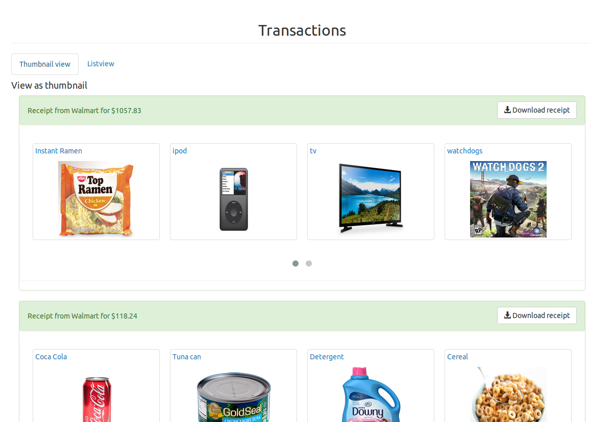
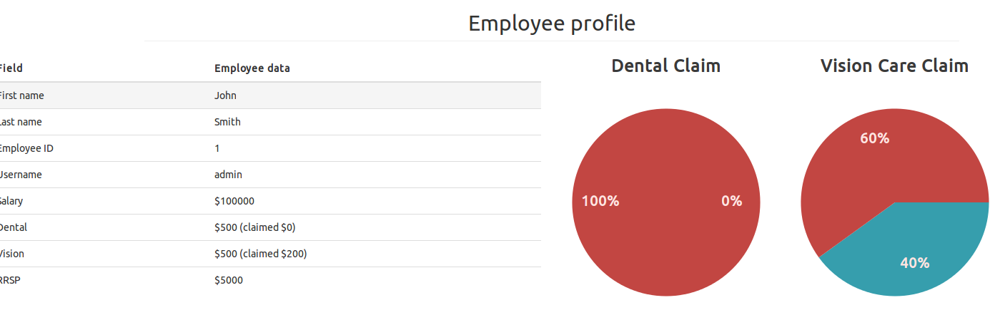
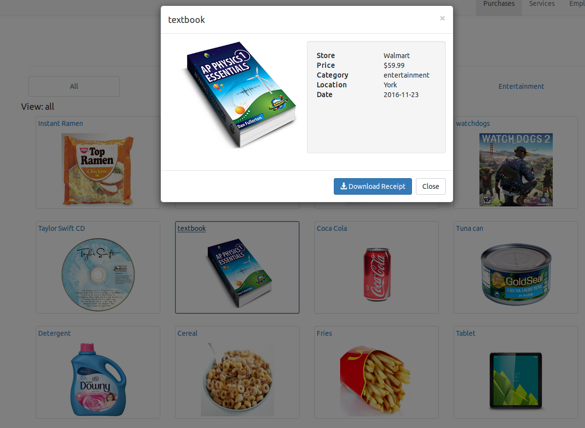

# iexpense
**iExpense** is a webapp which keeps track of a user's shopping receipts to log the items they have purchased.
Developed with HTML/CSS, Bootstrap, Javascript, jQuery, MySQL, PHP.

## About
iExpense is an online receipt manager that keeps track of all employees’ company-related expenditures in one single space. It allows employees to record all their expenses under unique accounts and acts as an efficient means for companies to reimburse business trips and employee benefits. Management can also use this timely receipt tracker to control budgets and perform internal audits more effectively. With all the company’s employee transactions available in this webapp, companies will be able to decrease cash fraud.

## Features
- Secure transfer of receipt to database through NFC, QR code or URL
- History of receipts separated by purchases and services
- Easy-access for managers to all employee accounts
- Authenticity of company-related receipts
- Reliable database that retrieves desired purchases

## Screenshots

### Transactions - view your recent receipts

 
 

### Services / Employee Profile - Statistical analysis

 
 

### Purchases - detailed description of each item purchased

